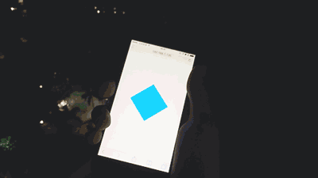

## ShakeEvent Module for FramerJS



#### DEMO: (Open in your phone)
### 👉 <http://share.framerjs.com/bb1is3lkolp7/>


#### Use:
Place `shake.coffee` to the folder named "module" in your project.

``` coffeescript
ShakeEvent = require "shake"
# ...
ShakeEvent.onShake = ()->
	alert "shaked!"
```

#### Options:

``` coffeescript
ShakeEvent.throttleInterval = 1   # Default 1   (secend)
ShakeEvent.sensitivity      = 20  # Default 20  (a lower number is more)
```